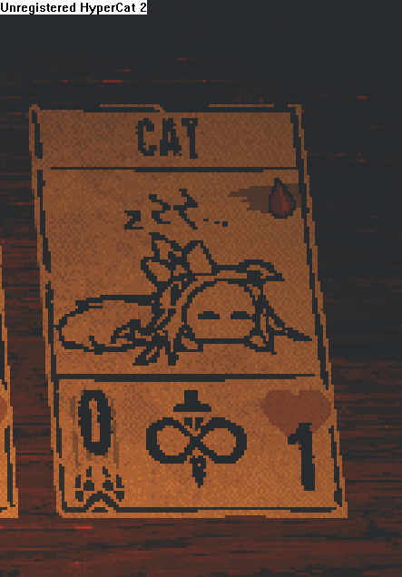

# Inscryption - Eir over Cat

Replaces Cat and Undead Cat with my OC. This change is purely cosmetic.

Also adds a custom starter deck for Kaycee's Mod to more easily see both forms in game.

## Dependencies

* [BepInExPack Inscryption](https://inscryption.thunderstore.io/package/BepInEx/BepInExPack_Inscryption/)
* [Inscryption API](https://github.com/InscryptionModding/InscryptionAPI)
* [JSONCardLoader](https://inscryption.thunderstore.io/package/MADH95Mods/JSONCardLoader/) (The github is strangely stuck on release v1.7.2, but not the thunderstore page. Huh.)

## Previews

### Act I/Kaycee's Mod

### Act II

### Custom starter pack (for testing purposes)

